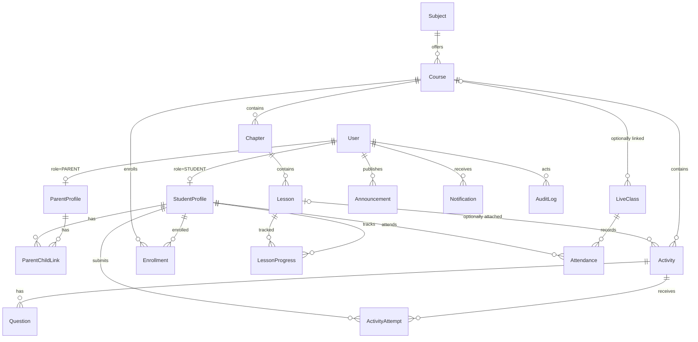

# Data model

The full schema lives in [`prisma/schema.prisma`](../prisma/schema.prisma).
SQLite is used in development; the schema is Postgres-compatible
(see [deployment.md](deployment.md)).

## Entity-relationship overview

## Identity & family graph

### `User`
The single account table for all four roles (`SUPER_ADMIN`, `ADMIN`,
`PARENT`, `STUDENT`). Holds `email` (unique), `passwordHash` (bcrypt),
names, `avatarColor`, `isActive` (soft disable) and `lastLoginAt`.

### `StudentProfile`
One-to-one with a `STUDENT` user. Carries the school identity:
`admissionNo` (unique, `MRD-#####`), `gradeLevel` (**0 = Kindergarten,
1-10 = Grade 1-10**), optional `section` and `dateOfBirth`.

### `ParentProfile`
One-to-one with a `PARENT` user; optional `phone`.

### `ParentChildLink`
The many-to-many family graph: **a parent can have any number of children,
and a child can have several guardians** (mother, father, guardian — the
`relationship` label). Unique per `(parentId, studentId)`. Every parent-facing
query is scoped through this table — a parent can never read another family's
data.

## Curriculum

### `Subject`
Catalog entry (`Mathematics`, `Science`, …) with a unique `code`.

### `Course`
A subject offering for one grade level (e.g. *Mathematics — Grade 4*).
Has a unique `slug`, `coverColor`, `isPublished` flag (students only ever see
published courses) and a `createdBy` admin.

### `Chapter` → `Lesson`
Ordered (`sortOrder`) content tree. A lesson has a `contentType`
(`ARTICLE`, `VIDEO`, `PDF`, `INTERACTIVE`), markdown `content` (rendered by
the XSS-safe internal renderer), optional `videoUrl` (embed),
`durationMinutes` and its own `isPublished` flag.

## Assessment

### `Activity`
Belongs to a course and optionally to a specific lesson. Types: `QUIZ`,
`ASSIGNMENT`, `WORKSHEET`, `PROJECT`. Carries `maxScore`, `passScore`
(absolute points), optional `timeLimitMinutes` and `dueAt`, and
`isPublished`.

### `Question`
Ordered questions for an activity. Types: `MCQ`, `TRUE_FALSE`,
`SHORT_ANSWER`. `options` is a JSON string array; `correctAnswer` holds the
key (exact option text, or the expected short answer — matched
case-insensitively). Answer keys are **stripped from student API responses**.

### `ActivityAttempt`
One row per student attempt: `status` (`IN_PROGRESS` → `SUBMITTED` →
`GRADED`), `answers` (JSON map `questionId → answer`, or `{ response }` for
free-form submissions), `score`, `maxScore` snapshot, `feedback`, `gradedBy`.
Activities **with questions auto-grade on submit**; question-less
assignments/projects wait in the manual grading queue.

## Enrollment & progress

### `Enrollment`
Unique `(studentId, courseId)`. Created singly or in bulk
("enroll every student of this grade").

### `LessonProgress`
Unique `(studentId, lessonId)` with `status`
(`NOT_STARTED` / `IN_PROGRESS` / `COMPLETED`), accumulated
`timeSpentMinutes` and `completedAt` — the raw material for the parent
progress and learning-time stats.

## Live classes

### `LiveClass`
Scheduled session for one grade level, optionally linked to a course.
`provider` is `"zoom"` (auto-created meeting: `zoomMeetingId`, `joinUrl`,
`startUrl`, `passcode`) or `"manual"` (pasted link). Status:
`SCHEDULED` / `LIVE` / `ENDED` / `CANCELLED`.

### `Attendance`
Pre-created as `ABSENT` for every active student of the grade when a class is
scheduled; flipped to `PRESENT` or `LATE` (join later than the configurable
threshold, default 10 min) when the student clicks *Join*.

## Communications

### `EmailTemplate`
Database-backed, admin-editable templates keyed by `key`
(`welcome_student`, `activity_result`, …). `subject` and `bodyHtml` support
`{{variable}}` placeholders; `variables` documents what's available.
`isActive` disables a template without deleting it.

### `EmailLog`
Every outgoing message with `status` `SENT` / `FAILED` / `SKIPPED`
(SMTP not configured) and the error, if any.

### `Announcement`
Broadcasts targeted by `audience` (`ALL`, `STUDENTS`, `PARENTS`, `ADMINS`,
or `GRADE` + `gradeLevel`), with `isPinned` ordering.

### `Notification`
Per-user in-app notifications (bell menu) with `readAt` tracking.

## Platform

### `Setting`
Key-value runtime settings (platform name, academic year, pass percentage,
late threshold). Secrets never live here — they stay in environment variables.

### `AuditLog`
Append-only trail: `actor`, dotted `action` (`auth.login`,
`curriculum.create_course`, `activities.grade_attempt`, …), `entityType` /
`entityId`, JSON `meta` and `ip`. Written by services via `audit()` — a
failure to write never breaks the request.
